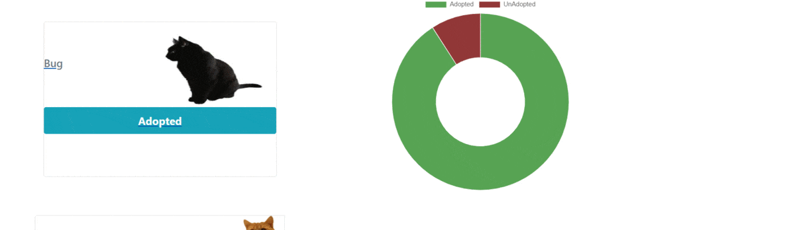

# CATStone
  CATStone is intended to help neighborhoods come together to rescue, discuss and view strays in their zip code. When a user registers, the app saves their zip and filters it to show relevant feline  friends.

## Table of Contents
  * [Project Requirements and Features List](#project-requirements-and-features-list)
  * [Technologies Used](#technologies-used)
  * [Installing and Launching CATStone](#instructions-for-installing-CATSTone)
  * [Appendix 1: Planning Documentation](#appendix-1-planning-documentation)
    * [Entity Relationship Diagrams](#entity-relationship-diagram)
    * [Wireframes](#wireframes)
  * [Appendix 2: Set Up Instructions](#appendix-2-set-up-instructions)

## Project Requirements and Features List
### Get Started
When a user first registers an account with CATStone, providing their zip code, they will be taken to a landing page showing all known strays in their area.They then have the ability to select a select a known stray in the area to learn more about the cat, chat about the cat or adopt the cat if has not already been adopted. They have the ability to delete chats that they have posted, delete a cat if it is no longer living in their area, add a cat to their zip code with details and a photo or they may log out.


## Technologies Used
  ### Development Languages, Libraries and Tools
  </img> </img> </img> </img></img>


## Instructions for Installing Simplified Supper
  To launch the CATStone app, you will need to have access to command line tools, node package manager, JSON Server. If you do not have access to any of these tools, you can find instructions for installing them in the [Appendix.](#appendix-2-set-up-instructions)

  Clone this repo on you personal machine using the following command
  ```sh
    git clone git@github.com:skgilmore/CATStone.git
  ```

  Install the NPM dependencies for this project using the following commands
  ```sh
    cd capstone
    npm install
  ```

  From your terminal window, type
  ```sh
    npm start
  ```

  Now that the server is up and running, you can open an internet browser and access the application
  ```sh
    http://localhost:8080/
  ```

 ### Congratulations you are now experiencing CATStone!

  ## Appendix 1: Planning Documentation

  ### Entity Relationship Diagram
  

  ### Wireframes/ Mockups
  </img> </img>
  </img> </img>
  


  ## Appendix 2: Set Up Instructions

  You will need to have command line tools installed for your computer to use terminal commands.

  Linux/ Windows users, please visit the [Git page](https://git-scm.com/book/en/v2/Getting-Started-Installing-Git) and follow the instructions for set up

  Mac users follow the instructions below

  Open your terminal and type
  ```sh
    git --version
  ```

  You will now need to configure your git account. In the terminal window, type:
  ```sh
    git config -global user.name "Your Name"
    git config -global user.email "Your Email"
  ```

  If you do not have Node.js installed on your machine, visit the [Node.js Download Page](https://nodejs.org/en/download/) and  follow the instructions. To ensure that it is installed correctly, in your terminal window, type
  ```sh
    echo $PATH
  ```
  Ensure that the result has the following in the $PATH
  ```sh
    /usr/local/bin
    or
    /usr/local/bin:/usr/bin:/bin:/usr/sbin:/sbin
  ```

  Now you can follow the [installation instructions](#instructions-for-installing-CATStone) to get CATStone up and running on your machine.

  This project was bootstrapped with [Create React App](https://github.com/facebook/create-react-app).

